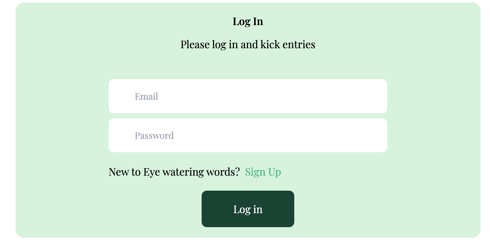

# 📝 Eye Watering Words

**Eye Watering Words** is an interactive feedback platform where users can share their thoughts, ideas, and experiences. Built with **React**, **Redux**, **Tailwind CSS**, **Node.js**, and **MongoDB**, it provides a dynamic, user-friendly space for open expression. Users can register, post entries, comment on others' posts, and customize their profiles.

---
## 🚀 Features

- **User Authentication**: 
  - Secure registration with email validation and password checks.
  - Users can select a custom username or generate one randomly.
- **Dynamic Entries & Comments**:
  - Users can create entries with custom tags, edit, or delete them.
  - Add comments on entries (their own or others’), with edit and delete functionality.
- **Personalized Profiles**: 
  - Upload an avatar, and view your entries and comments in one place.
- **Search Functionality**:
  - Search entries by tags, usernames, or entry content.
- **Data Management**:
  - All data is securely saved in **MongoDB** via **Node.js** and managed with **Redux** for optimal state handling.
  
---

## 🛠️ Tech Stack

- **Frontend**: React, Redux, Tailwind CSS, HTML, CSS
- **Backend**: Node.js, Express
- **Database**: MongoDB

---

## 📸 Screenshots

- **Add new entry page**
   
- **Comment page**
  
- **Register&Log in page**
  

  

  

   
  

---

## 🔑 Usage

1. Register an account with email, username, and password.
2. Log in and start creating entries!
3. Edit/Delete entries and comments you’ve posted.
4. Search for entries by tag, username, or keywords.
5. Profile Customization: Upload an avatar and manage your entries and comments.

   
---

## 📚 Learning & Insights
Through this project, I gained valuable experience in:

- State Management with Redux for smoother and efficient data flow.
- Authentication & Authorization using JWT and user validation.
- Backend Development with MongoDB and Node.js for handling dynamic content.
- Frontend Design using Tailwind CSS for a responsive, polished UI.

## 📄 License
This project is open-source and available for personal or educational use.

## 📬 Contact
If you have any questions or feedback, feel free to reach out via [LinkedIn](https://www.linkedin.com/in/selenkarakaya/) or [GitHub](https://github.com/selenkarakaya).

